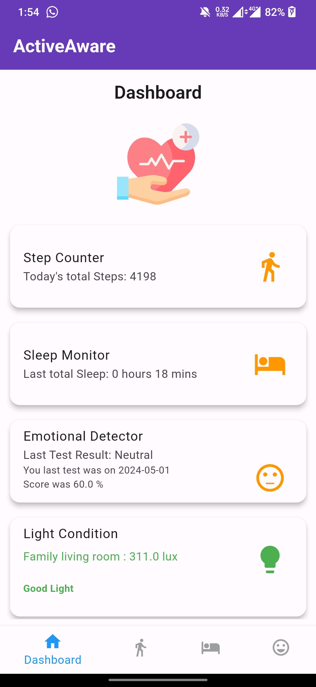
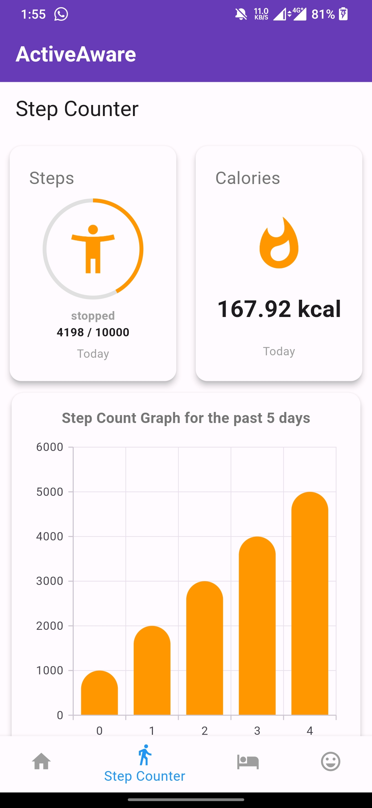
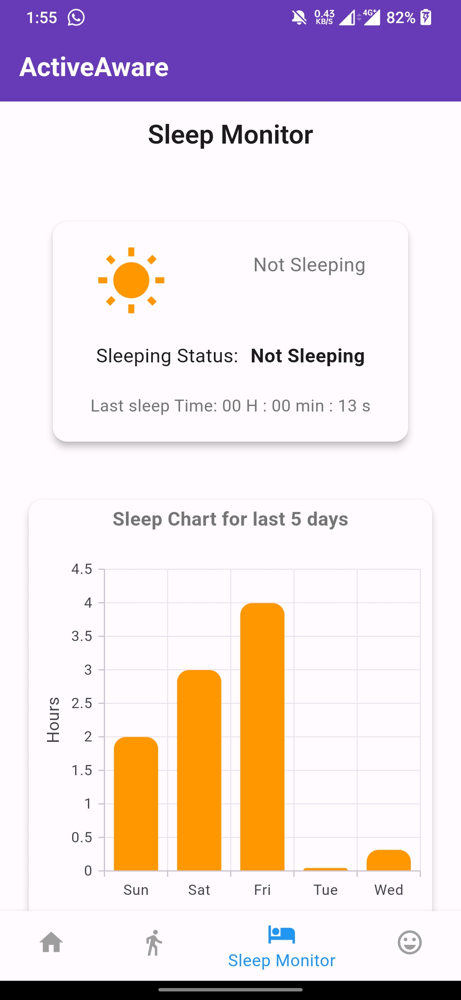
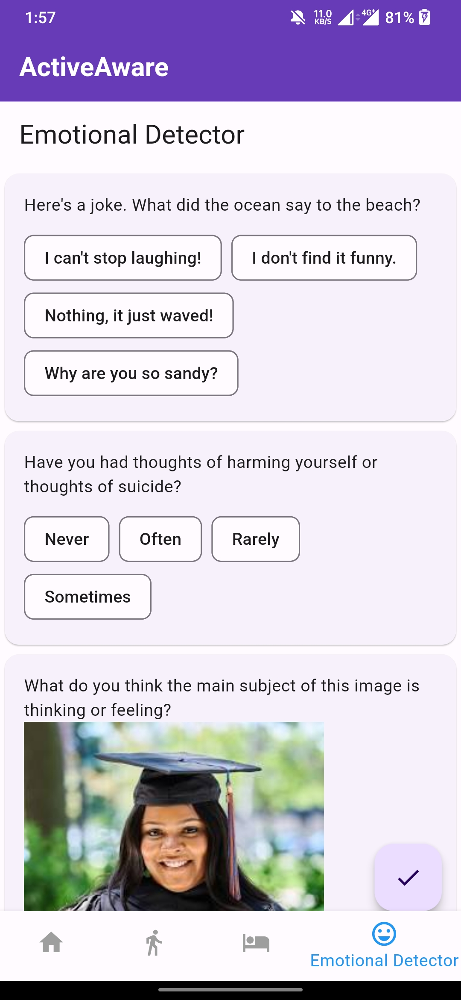

# Active Aware - A SmartPhone-Based Health Companion System

## Screenshots 📸

| Dashboard | Step Counter |
|:-----------------:|:-----------------:|
|  |  |

| Sleep Tracker | Emotion Detection |
|:-----------------:|:-----------------:|
|  |  |

Welcome to Active Aware - your personal health companion app designed to help you achieve a balanced lifestyle encompassing proper sleep, physical activity, and emotional well-being. 🌟

Active Aware offers a range of features to track your daily activities, analyze your sleep patterns, and understand your emotions. Let's explore the app in detail!

## Introduction 📱

Active Aware is a smartphone-based health companion app developed by Team Pirates for CS4472 Mobile Computing. With a focus on holistic health, the app aims to empower users to lead healthier lives by providing insights into their sleep, activity levels, and emotional well-being.

## Overview 🌐

Active Aware provides a central dashboard where users can access information from three key functionalities:

- **Step Counter**: Track your daily steps, burned calories, and progress towards your activity goals.
- **Sleep Tracker**: Analyze your sleep patterns, view sleep status, last sleep time, and sleep history.
- **Emotion Detection**: Understand your emotions through questionnaires and mood analysis tools.

The dashboard also displays your current mood and provides a light intensity indicator for healthy habits. 💡

## Features 🚀

### Dashboard 📊

The Dashboard page offers a comprehensive view of your health data, including step count, sleep monitor, and emotion analyzer. Simply click on the icons to access detailed insights for each functionality. Your current mood and light intensity indicator are prominently displayed for easy reference.

### Step Counter 🏃‍♂️

The Step Counter page provides real-time updates on your daily step count, burned calories, and progress towards your activity goals. Visualize your step count graph for the past five days and stay motivated to achieve your fitness targets.

### Sleep Tracker 💤

Track your sleep patterns with the Sleep Tracker feature. View your most recent sleep status, last sleep time, and explore your sleep history for deeper insights into your sleep quality and duration.

### Emotion Detection 😊

Understand and manage your emotions with the Emotion Detection feature. Answer questionnaires to analyze your emotional health and track your mood over time. Cultivate positive emotions and build resilience for a healthier mindset.

For the emotion detection feature, we utilize a Python server to perform model predictions. To run the Python server:

1. Navigate to the `server` directory.
2. Install the required dependencies by running `pip install -r requirements.txt`.
3. Start the server by running `python run`.

To access the Emotion Detection feature from different networks, you can use ngrok. Ngrok provides a secure tunnel to your localhost, allowing external access to your locally hosted server. Here's how to set it up:

1. Download `ngrok` from the official website and follow the installation instructions for your platform.
2. After installation, navigate to the directory where ngrok is located.
3. Start ngrok by running `ngrok http 5000`, Since Python server is running on 5000.
4. Ngrok will generate a public URL that forwards requests to your local server.
5. Copy the ngrok URL and replace the server URL in the `emotional_detector_screen.dart` file with the ngrok URL. Ensure to update the URL whenever ngrok generates a new one.

With ngrok set up, you can now access the Emotion Detection feature from any network by using the ngrok URL.

## Sensor Usage and Permissions 🛠️

Active Aware utilizes the following sensors and permissions:

- **Sensor Usage**:
  - `Proximity Sensor`: Used to detect the proximity of an object to the device.
  - `Accelerometer`: Utilized to detect movement and determine sleep patterns.
  - `Light Sensor`: Employed to measure ambient light intensity(lux) for enhancing sleep monitoring accuracy.
  
- **Permissions**:
  - `INTERNET`: Required for internet access to fetch data and perform certain operations.
  - `BODY_SENSORS_BACKGROUND`: Allows access to body sensors for collecting data in the background.
  - `ACTIVITY_RECOGNITION`: Necessary for recognizing the user's activity state.
  - `WAKE_LOCK`: Grants the app permission to keep the device awake to perform tasks.
  - `CAMERA`: Enables access to the device's camera for certain functionalities.
  
## Installation 🛠️

Getting started with Active Aware is easy:
1. Clone the repository to your local machine.
2. Open the project in your preferred IDE or code editor.
3. Ensure you have Flutter installed. If not, follow the [Flutter installation guide](./Installation.md).
4. Run the app on your emulator or physical device using `flutter run`.

## Light Conditions Based on Lux Value

| Lux Value Range    | Light Condition               |
|--------------------|-------------------------------|
| Lux ≥ 50,000       | British Summer sunshine      |
| 10,000 ≤ Lux < 50,000 | Ambient Daylight          |
| 1,000 ≤ Lux < 10,000 | Overcast daylight          |
| 500 ≤ Lux < 1,000  | Well lit office              |
| 400 ≤ Lux < 500    | Sunset & Sunrise             |
| 120 ≤ Lux < 400    | Family living room           |
| 100 ≤ Lux < 120    | Lifts                        |
| 15 ≤ Lux < 100     | Street lightning             |
| 1 ≤ Lux < 15       | Moonlight (full moon)        |
| 0.1 ≤ Lux < 1      | Night (No moon)              |
| Lux < 0.1          | Unknown                      |

## Emotion Detection Icons and Scores

| Mood Score Range      | Mood Icon                        |
|-----------------------|----------------------------------|
| Mood Score < 50       | 😡 Very Dissatisfied (Red)       |
| 50 ≤ Mood Score < 70  | 😐 Neutral (Orange)              |
| Mood Score ≥ 70       | 😊 Very Satisfied (Green)        |

## Light Condition Values

| Lux Value Range | Light Condition          | Icon Color    |
|-----------------|--------------------------|---------------|
| luxValue < 20   | Very Poor Light          | Red Accent    |
| 20 ≤ luxValue < 100 | Poor Light            | Orange        |
| luxValue ≥ 100  | Good Light               | Green         |

## Dependencies 📦

Active Aware relies on the following dependencies:
- flutter: ^2.8.0
- cupertino_icons: ^1.0.6
- syncfusion_flutter_charts: ^25.1.41+2
- provider: ^6.1.2
- shared_preferences: ^2.2.3
- http: ^1.2.1
- camera: ^0.10.5+9
- path_provider: ^2.1.3
- path: ^1.9.0
- sensors_plus: ^5.0.1
- proximity_sensor: ^1.3.1
- light: ^3.0.1
